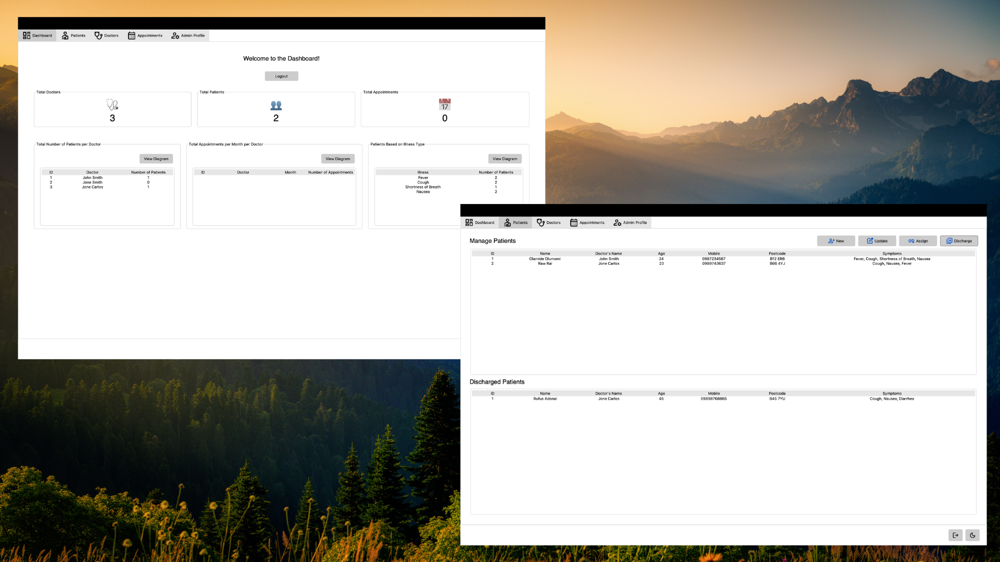

# Mini Hospital App - Python GUI



## 📌 Introduction
The **Mini Hospital App** is a simple yet functional hospital management system built with Python and a GUI framework (Tkinter/PyQt/others). It helps manage patient records, doctor records, and appointments in a user-friendly interface.

## ✨ Features
- Add, update, and delete patient records
- Schedule doctor appointments
- User-friendly graphical interface
- Simple data storage

## 🛠️ Installation
To run this project locally, follow these steps:

1. **Clone the Repository:**
   ```bash
   git clone https://github.com/scientist-Momi/python_gui.git
   cd python_gui
2. **Install Dependencies:**
   ```bash
   pip install -r requirements.txt
3. **Run Application:**
   ```bash
   python main.py

## 🎨 Credits
This project uses a custom theme. Credit to [rdbende](https://github.com/rdbende/Azure-ttk-theme.git) for their amazing design.

